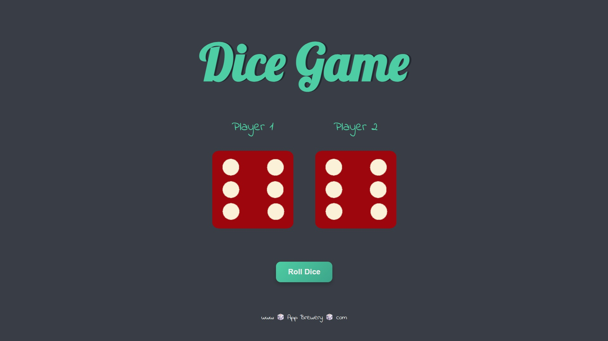
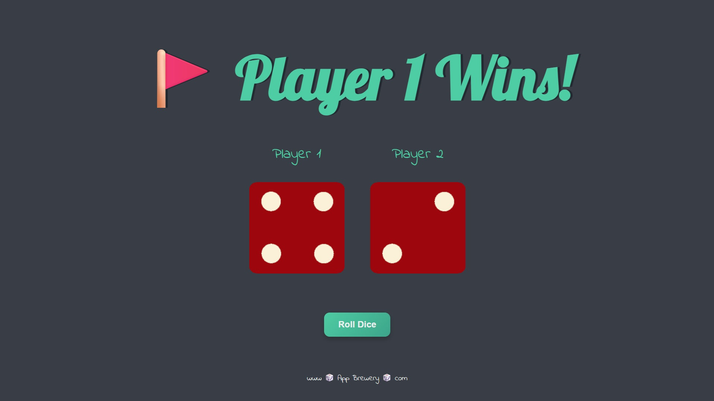
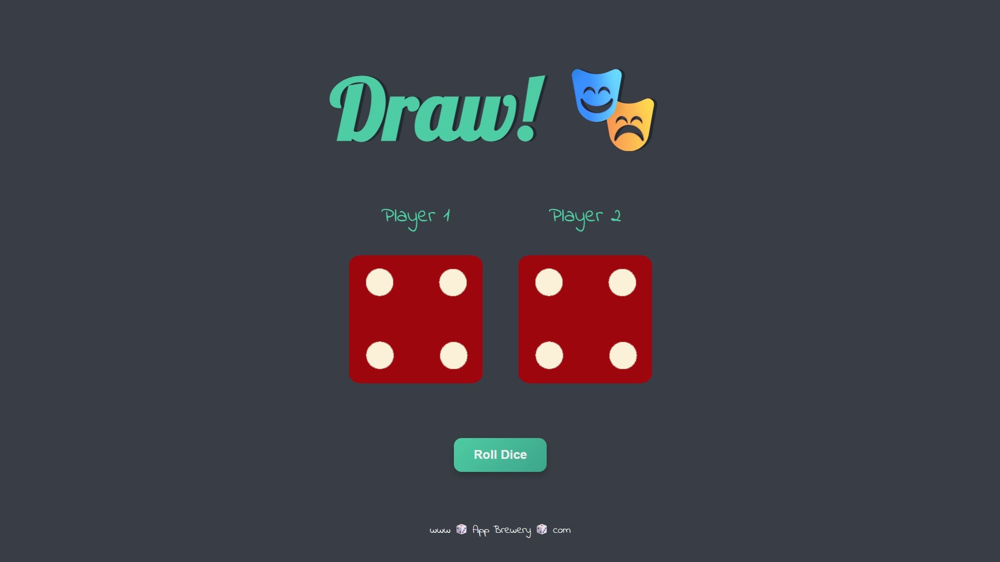

# Dice Game

This is a **Simple Dice Game** made with **HTML, CSS, and JavaScript**, based on Angela Yu's Web Development course. 

## How to Play
Click the "Roll Dice" button to roll the dice. The player with the higher number wins.

## Screenshot

## Credits
Project adapted from **Angela Yu's Web Development course (The App Brewery)**.